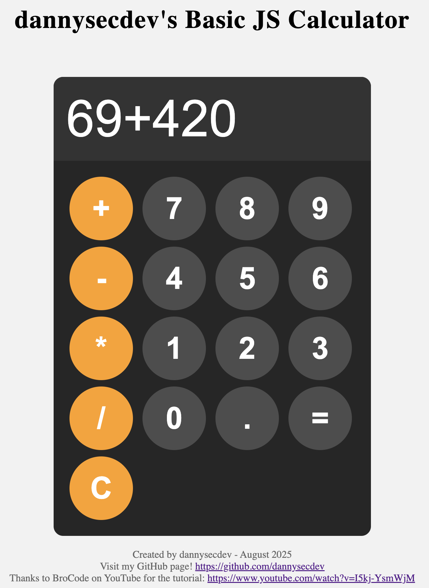

# dannysecdev's Basic JS Calculator

A simple JavaScript calculator web app, based on a [BroCode YouTube tutorial](https://www.youtube.com/watch?v=I5kj-YsmWjM).

## Features

- Basic arithmetic operations: addition, subtraction, multiplication, division
- Responsive and clean UI
- Built with HTML, CSS, and JavaScript

## Demo

 <!-- Add a screenshot if you have one -->

## Getting Started

1. **Clone the repository:**
   ```sh
   git clone https://github.com/dannysecdev/js-calculator-aug24th2025.git
   cd js-calculator-aug24th2025
   ```

2. **Open `index.html` in your browser.**

No build steps or dependencies required.

## Attribution

- Based on [BroCode's JavaScript Calculator Tutorial](https://www.youtube.com/watch?v=I5kj-YsmWjM)
- Created by [dannysecdev](https://github.com/dannysecdev)

## License

MIT License


